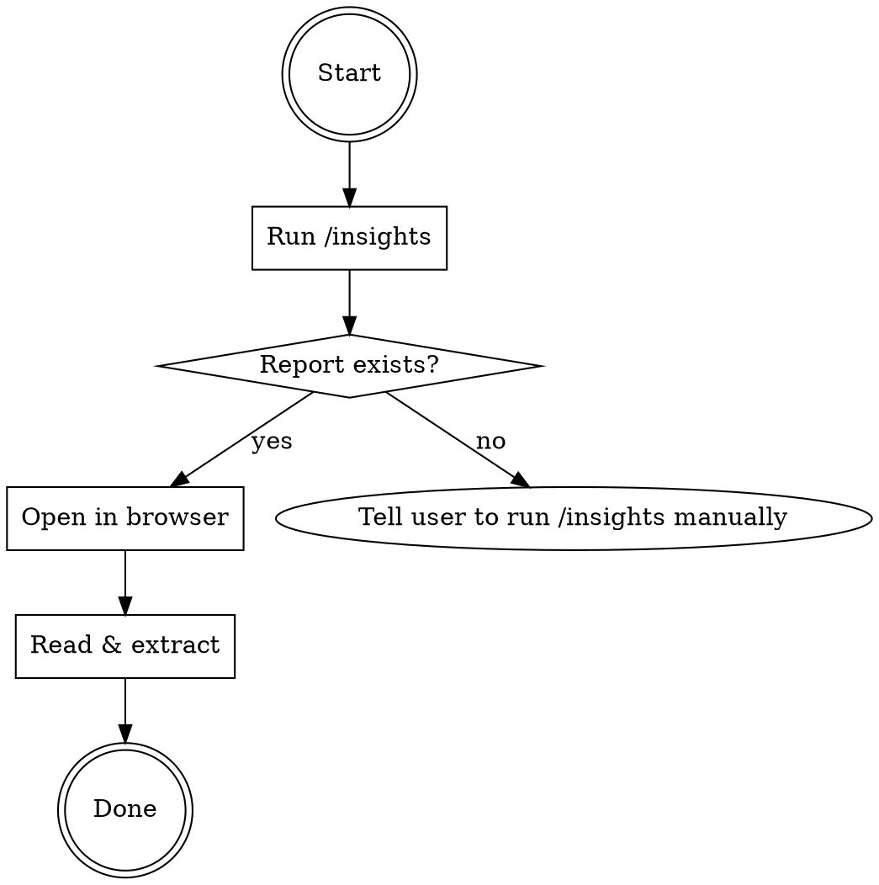

# Insights Report

Generate, open, and extract actionable recommendations from Claude Code usage insights.

## Workflow



## Step 1: Generate Insights

Run the `/insights` command using the Skill tool:

```
Skill tool: skill: "insights"
```

If the Skill tool fails (built-in command), use Bash:

```bash
claude -p "/insights" --allowedTools "Read,Bash,Glob,Grep"
```

If both fail, ask the user to run `/insights` manually, then proceed to Step 2.

## Step 2: Open Report in Browser

The report lives at `~/.claude/usage-data/report.html`.

Open it in the default browser:

```bash
start "" "C:/Users/simon/.claude/usage-data/report.html"
```

Tell the user the direct URL: `file:///C:/Users/simon/.claude/usage-data/report.html`

## Step 3: Extract Actionable Content

Read the report HTML from `~/.claude/usage-data/report.html`.

Do NOT output statistics (message counts, session counts, tool usage numbers, charts, etc.).

Instead, output the following sections in this exact order:

### 1. Where Things Go Wrong

Extract from the `section-friction` area. Output as bullet points:
- For each friction category, output the **title** as a bold bullet
- Under it, output the **description** as a sub-bullet
- Under that, output each **example** as a sub-sub-bullet

### 2. Existing CC Features to Try

Extract from the `section-features` area. Output ALL content:

**CLAUDE.md Additions:** For each suggested CLAUDE.md item, output:
- The full text of the CLAUDE.md addition (from the `data-text` attribute or `cmd-code` element) as a fenced code block
- The "why" explanation underneath

**Feature Cards:** For each feature card (Custom Skills, Hooks, Headless Mode, etc.), output:
- The feature title and one-liner description
- The "Why for you" explanation
- The full example code block exactly as shown

### 3. New Ways to Use Claude Code

Extract from the `section-patterns` area. Output ALL content:

For each pattern card, output:
- The pattern title and summary
- The full detail/explanation text
- The full "Paste into Claude Code" prompt as a fenced code block

### 4. Headless Mode Command Lines

Collect all headless mode (`claude -p ...`) command lines from anywhere in the report. Output each as a fenced code block with a brief label of what it does.

### 5. On the Horizon

Extract from the `section-horizon` area. Output ALL content:

For each horizon card, output:
- The title
- The full "what's possible" description
- The "Getting started" tip
- The full "Paste into Claude Code" prompt as a fenced code block

### 6. Output 
- Output a markdown file ./insights_report_{timestamp}.md
