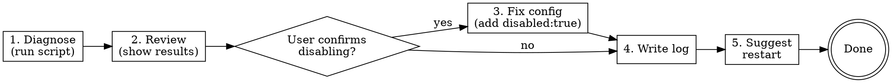

# MCP Doctor

## Overview

Diagnoses and repairs broken MCP server configurations. Validates that each server's binary exists and is reachable, then disables broken entries to restore startup.

## When to Use

- omp/Claude Code crashes on startup with EPIPE or connection errors
- MCP tools are unavailable or timing out
- After adding/modifying servers in `~/.claude/mcp.json`
- Periodic health check of all configured servers

**Not for:** MCP protocol-level debugging, server-side logic issues, or auth token problems (those require testing the server itself).

## Workflow



### Step 1: Run Diagnostic

```bash
bash ~/.claude/skills/mcp-doctor/scripts/mcp_doctor.sh
```

Output: JSON array of `{ "name", "status", "reason", "command" }` per server.

### Step 2: Present Results

Format as a table for the user:

| Server | Status | Command | Issue |
|--------|--------|---------|-------|
| example | OK/WARN/FAIL/SKIP | node | (reason if any) |

### Step 3: Fix Broken Servers

Ask user: "Should I disable the FAIL servers in `~/.claude/mcp.json`?"

On confirmation, read the config file and add `"disabled": true` to each FAIL server entry. Preserve existing fields and formatting.

### Step 4: Create Log

Write to `~/.claude/logs/mcp-doctor-<YYYY-MM-DD-HHmmss>.log`:

```
MCP Doctor Report - <timestamp>
================================
<server>: <STATUS> - <reason>
...
Actions taken: Disabled <list of servers>
```

### Step 5: Suggest Restart

Tell user to restart omp/Claude Code to apply the fixed config.

## Quick Reference

| Status | Meaning | Action |
|--------|---------|--------|
| OK | Binary found, arg paths valid | None |
| WARN | Binary found, arg path missing | Inform user, don't disable |
| FAIL | Binary not found / docker not running | Disable on user confirmation |
| SKIP | Already has `"disabled": true` | None |

## Common Mistakes

- **Disabling WARN servers** - Only disable FAIL. WARN means the binary exists; missing arg paths may be created at runtime (e.g., npx downloads packages).
- **Skipping the log** - Always write the log. It's the audit trail for what changed and why.
- **Editing config without reading it fresh** - Always re-read `mcp.json` before editing; another process may have changed it.
- **Forgetting the restart** - Config changes only take effect after restart.
